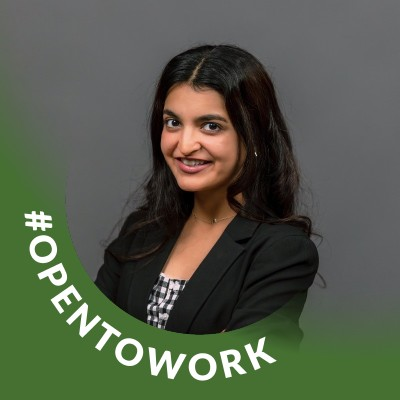

:::{.profile-shell}
::: {.profile-image-wrap}
{.profile-image}
:::

::: {.profile-copy}
::: {.eyebrow}
About me
:::

# Prabhlin Kaur Matta

::: {.hero-lead}
I'm a business analytics graduate student and marketing analytics professional focused on turning consumer, pricing, and campaign data into practical business decisions.
:::

I am currently pursuing an MS in Business Analytics at UC San Diego, expected June 2026, after completing a PGDM in Marketing from the Welingkar Institute in April 2022. My background combines analytics, consumer research, and commercial strategy, with experience supporting decisions across pricing, promotions, portfolio optimization, and marketing performance.

At NielsenIQ, I worked on line and price optimization and consumer insights engagements for brands including Unilever, Nestle, Mondelez, Samsung, Reliance, and McCormick. My work included analyzing large retail and survey datasets, building Power BI dashboards, synthesizing findings from 100+ focus groups and interviews, and helping clients translate evidence into clearer growth and pricing decisions.

I enjoy roles where analytics is closely tied to action, whether that means identifying opportunity areas, strengthening campaign decisions, or helping teams communicate insights with more confidence.

::: {.button-row}
[LinkedIn](https://www.linkedin.com/in/prabhlinkm/){.button-primary}
[View Resume](resume.qmd){.button-secondary}
[See Projects](projects.qmd){.button-secondary}
:::
:::
:::

:::{.section-shell}
## Professional Profile

::: {.feature-grid}
::: {.feature-card}
### What I Work On
Business analytics, consumer insights, pricing strategy, campaign performance analytics, and marketing decision support.
:::

::: {.feature-card}
### Industry Exposure
Experience supporting globally recognized consumer and retail brands across structured analytics and client-facing insight delivery.
:::

::: {.feature-card}
### How I Add Value
I connect quantitative analysis with business context so recommendations are clear, credible, and useful to decision-makers.
:::
:::
:::

:::{.section-shell .section-accent}
## Skills and Tools

::: {.pill-row}
::: {.pill}
SQL
:::

::: {.pill}
Python
:::

::: {.pill}
Polars
:::

::: {.pill}
Pandas
:::

::: {.pill}
NumPy
:::

::: {.pill}
Matplotlib
:::

::: {.pill}
Tableau
:::

::: {.pill}
Power BI
:::

::: {.pill}
Excel
:::

::: {.pill}
Google Analytics
:::

::: {.pill}
A/B Testing
:::

::: {.pill}
Segmentation
:::

::: {.pill}
Pricing and Promotion Strategy
:::

::: {.pill}
Ad Effectiveness
:::

::: {.pill}
Nielsen Retail and Survey Data
:::
:::

::: {.section-note}
My toolkit reflects a mix of analytics, visualization, experimentation, and insight generation used in real business decision support.
:::
:::

:::{.section-shell}
## Contact

::: {.contact-grid}
::: {.contact-card}
### Location
San Diego, CA
:::

::: {.contact-card}
### LinkedIn
[linkedin.com/in/prabhlinkm](https://www.linkedin.com/in/prabhlinkm/)
:::
:::
:::
